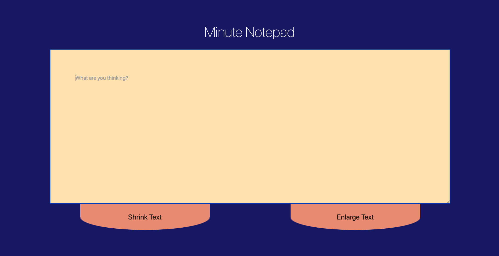

# Minute Notepad
Minute Notepad is an app for when you need a place to type something but you have no reason to save it. It is a website with a text box that you can type in, and that's all. No fonts, no styling, just a simple text field. When you refresh or leave the page all your work is gone, no need to delete or store extra files. 

## Use cases
- Writing down a phone number.
- Doing quick mathematical computations. Like splitting a bill with friends.
- Creating a shopping list (could be a dangerous decision).
- When you want to send a long message to someone that might require editing.

## Original Project
See it live: [Minute Notepad](https://jshams.github.io/minute-notepad)  
See the original repo: [Minute Notepad Code](https://github.com/jshams/minute-notepad)

## App Preview
