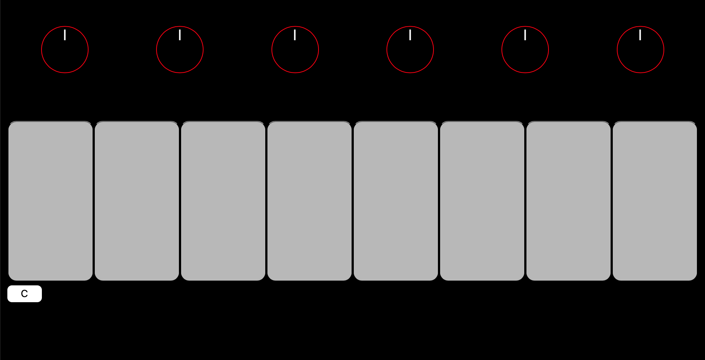

# Virtual Piano
Virtual Piano is an online piano player.
It only has eight keys, and you can chose between C and F major scales.
The app is extremely simple, and the knobs do nothing.

## Original Project
See it live: [Virtual Piano](https://jshams.github.io/virtual-piano)  
See the original repo: [Virtual Piano Code](https://github.com/jshams/virtual-piano)

## App Preview
